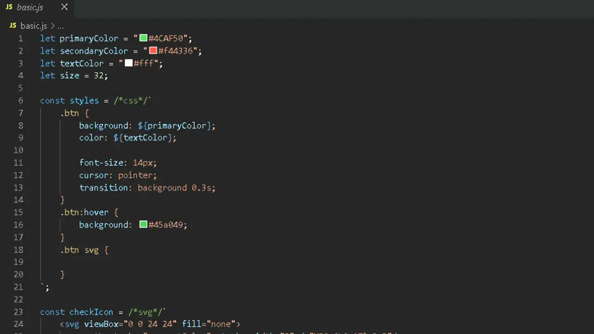

# HTML CSS SVG in JS



Highlight **template strings** in `JavaScript` and `TypeScript` files with `HTML`, `CSS`, or `SVG` syntax highlighting using **tagged comments**.

<br>

## ✨ Features

Colorizes template strings that start with:

- `/*html*/` highlighted as `HTML`
- `/*css*/` highlighted as `CSS`
- `/*svg*/` highlighted as `SVG`

Works in `.js`, `.ts`, `.jsx`, and `.tsx` files.

No extra setup required — just install and start coding.

### Snippets

Quickly insert template literals for `HTML`, `CSS`, and `SVG`:

- `html template block`:

    ```js
    /*html*/`
    
    `
    ```

- `css template block`:

    ```js
    /*css*/`
    
    `
    ```

- `svg template block`:

    ```js
    /*svg*/`
    
    `
    ```

<br>

## 🖼️ Example

```js
const button = /*html*/`
    <button class="primary">
      Click Me
    </button>
`;

const styles = /*css*/`
    .primary {
        background: #007bff;
        color: white;
        padding: 8px 12px;
        border-radius: 4px;
    }
`;

const icon = /*svg*/`
	<svg viewBox="0 0 24 24">
		<circle cx="12" cy="12" r="10" fill="red" />
	</svg>
`;
```

<br>

## 📦 Installation

#### Install from VS Code Marketplace

- Open Extensions View in `VS Code`.

- Search for `"HTML CSS SVG in JS"`.

- Click Install.

#### Install from GitHub

- Download the `.vsix` file from [releases](https://github.com/FrancoJavierGadea/HTML-CSS-SVG-in-JS/releases).

- Open `VS Code`.

- Open command palette (`Ctrl+Shift+P`).

- Type `Extensions: Install Extension` and select the `.vsix` file.

#### Install from command line

- Download the `.vsix` file from [releases](https://github.com/FrancoJavierGadea/HTML-CSS-SVG-in-JS/releases).

- Open a terminal.

- Run

	```shell
	code --install-extension html-css-svg-in-js-0.0.1.vsix
	```

<br>

### 📝 Sintax reference

- [text.html.basic](https://github.com/microsoft/vscode/blob/main/extensions/html/syntaxes/html.tmLanguage.json)
- [source.css](https://github.com/microsoft/vscode/blob/main/extensions/css/syntaxes/css.tmLanguage.json)
- [text.xml](https://github.com/microsoft/vscode/blob/main/extensions/xml/syntaxes/xml.tmLanguage.json)

<br>

## 📄 License

MIT License